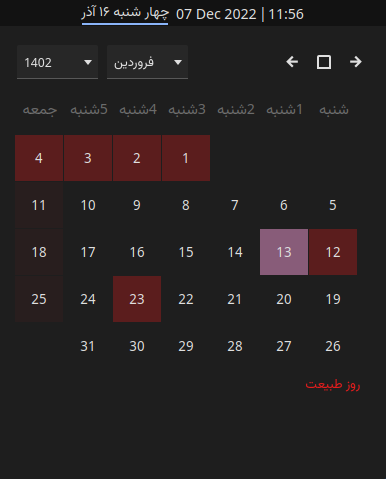

# KDE Plasma Shamsi Calendar
This is a plasmoid that is used to show Shamsi Calendar (also known as Persian Calendar or Jalali Calendar) in KDE Plasma available in the [KDE store](https://store.kde.org/p/1460130/). The Calendar supports official holidays.

## Customization
There is a bunch of customizations you can try on.

## Contributing
Thank you for considering contributing to the KDE Plasma Shamsi Calendar! Any contributions you make are greatly appreciated.

## License
Distributed under the GPL v3 License. See LICENSE for more information.

## Acknowledgements
* [Persian Date](https://github.com/babakhani/PersianDate)
* [Gnome Shamsi Calendar](https://github.com/SCR-IR/gnome-shamsi-calendar)